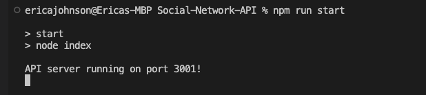
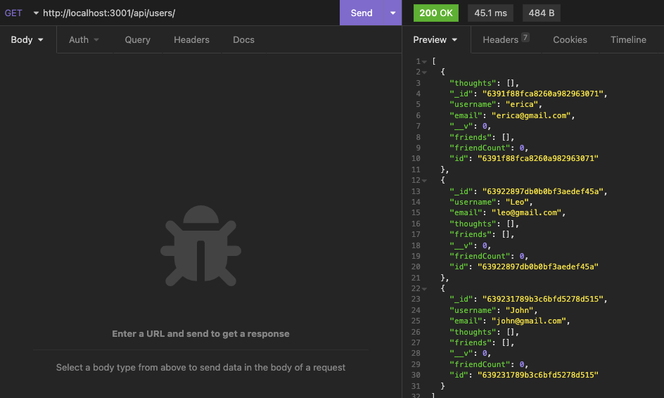
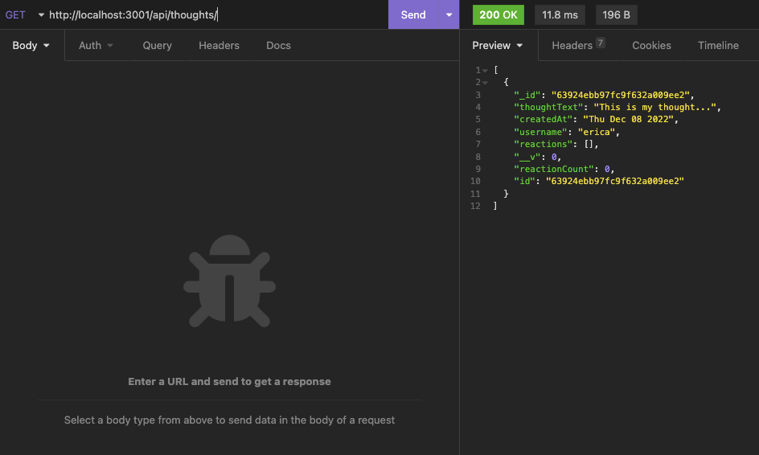

# Social-Network-API

## Description

This is an API for a social network web application where users can share their thoughts, react to their friend's thoughts and create a friend list. It utilizes Express.js, a Mongoose ODM, and MongoDB database.

- This projects uses best practices for RESTful APIs for easy implementation into projects.
- Building this project enhanced my understanding of MongoDB and Mongoose.
- This API enables developers to implement interactive features and save data securely to a database.
- I learned more about NoSQL databases and implementing Mongoose ODM.

## Installation

- Clone this repo.
- Open your terminal to the Social-Network-API folder.
- Run `npm run start`.
- Use API routes to interact with the data listed in routes file.

`Console Steps`

## Usage

The features in this API allow a developer to store thoughts, users, friends, and reactions. The API can read, create, update and delete users and thoughts, and create and delete friends and reactions.

`Seeing all users`

`Seeing all thoughts`

